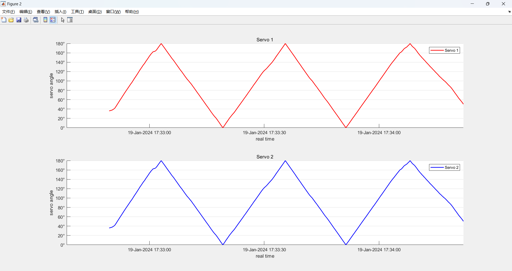

如本话题所说，还有一个MATLAB舵机随动控制程序。旨在使右侧舵机跟随左侧舵机一起运动，这样可以只输入一个信号实现双舵机的控制。

*Attention：* 这里是使用了**两个**引脚，如果用面包板导入同一个引脚，可能使信号微弱，达不到理想的转动效果。

随动的原理代码参见[here](../MATLAB_Servo_Follower_Control.m)

先控制`Servo1`的移动，再用`readPosition()`读取角度值传入`Servo2`，实现随动目标，大致效果如下：

可以看到蓝色是随动的信号，和红色主动件的同步性适配。
